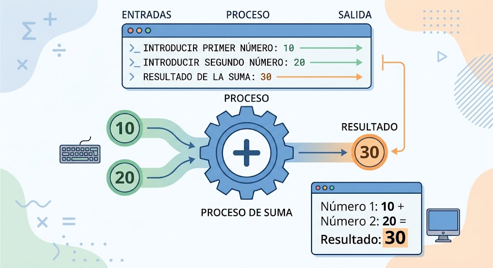

# Programa para sumar dos números

## Introducció

Aquest projecte consisteix a realitzar un programa senzill capaç de sumar dos números.

L'usuari introdueix dos números i el programa realitza l'operació matemàtica de suma.
Finalment, mostra el resultat per pantalla.

Aquest projecte serveix per aprendre els conceptes bàsics de programació i per entendre com un programa pot rebre dades, realitzar una operació i mostrar un resultat.

## Objectiu

L'objectiu principal d'aquest projecte és crear un programa que permeti sumar dos números d'una manera senzilla.

Amb aquest programa es pretén aprendre:

Com introduir dades.
Com treballar amb números.
Com realitzar una suma.
Com mostrar un resultat.
Com executar un programa.
Com documentar un projecte.
Com utilitzar un repositori de GitHub.

## Funcionament del programa

El funcionament del programa és molt senzill.

Primer, el programa demana a l'usuari que introdueixi el primer número.

Després, demana que introdueixi un segon número.

Un cop introduïts els dos números, el programa realitza la suma.

Finalment, mostra el resultat de l'operació.

Por ejemplo:

Si introducimos:

- Primer número: 5
- Segon número: 3

El programa mostra:

**Resultat: 8**

## Exemple

Un exemple de funcionament seria:

**Número 1:** 10

**Número 2:** 20

**Resultado:** 30

Un altre exemple:

**Número 1:** 7

**Número 2:** 4

**Resultat:** 11

## Operació realitzada

L'operació que realitza el programa és una suma.

La fórmula utilitzada és:

**Número 1 + Número 2 = Resultat**

Per exemple:

**5 + 3 = 8**

## Entrada de dades

El programa necessita dues dades per poder funcionar.

Aquestes dades són:

1. El primer número.
2. El segon número.

L'usuari introdueix aquests números quan el programa ho sol·licita.

## Resultat

Després d'introduir els dos números, el programa realitza la suma i mostra el resultat a la pantalla.

Per exemple, si introduïm:

**5** y **3**

el programa mostrarà:

**8**

## Imatge del projecte

La següent imatge representa el funcionament del programa i l'operació que realitza.

## Utilitat del programa

Tot i que es tracta d'un programa molt senzill, serveix per aprendre conceptes bàsics que s'utilitzen en programes més complexos.

La mateixa idea de rebre informació, processar-la i mostrar un resultat es pot utilitzar en molts altres programes.

## Dificultat

La dificultat d'aquest projecte és baixa perquè només es realitza una operació matemàtica.

Tanmateix, permet practicar conceptes importants per començar a programar.

És un bon exemple per entendre com funciona un programa de manera bàsica.

## Proves

Per comprovar que el programa funciona correctament es poden realitzar diferents proves.

### Prove 1 
Número 1: 5 
Número 2: 3 
Resultat esperat: 8 
### Prova 2 

Número 1: 10 
Número 2: 20 

#### Resultat esperat: 30

### Prova 3

Número 1: 1

Número 2: 9

#### Resultat esperat: 10

Si el resultat coincideix amb el resultat esperat, significa que la suma s'ha realitzat correctament.

## Conclusió

Aquest projecte permet crear un programa senzill per sumar dos números.

Durant la realització del projecte es pot aprendre com introduir dades, realitzar una operació i mostrar el resultat.

També serveix per practicar la creació de documentació i la utilització de GitHub per guardar i compartir un projecte.

Tot i que és un programa senzill, els conceptes utilitzats poden servir com a base per realitzar programes més complets en el futur.