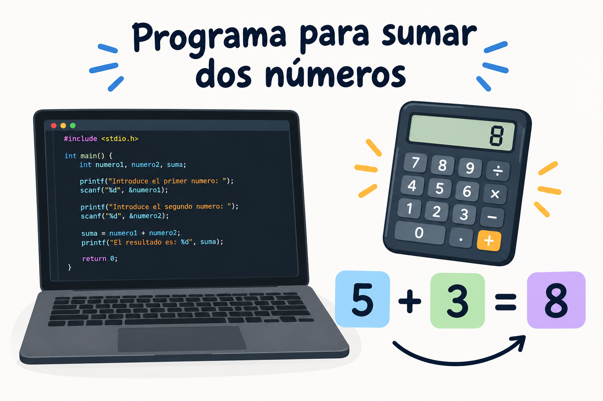

# Programa para sumar dos números

## Objetivo
Crear un programa sencillo que permita introducir dos números y calcular su suma.

## Funcionamiento
El programa pide al usuario dos números.
Después, suma los dos números y muestra el resultado por pantalla.´

## Ejemplo

5 + 3 = 8

## Conclusión
Este programa sirve para aprender a hacer una suma utilizando programación.
